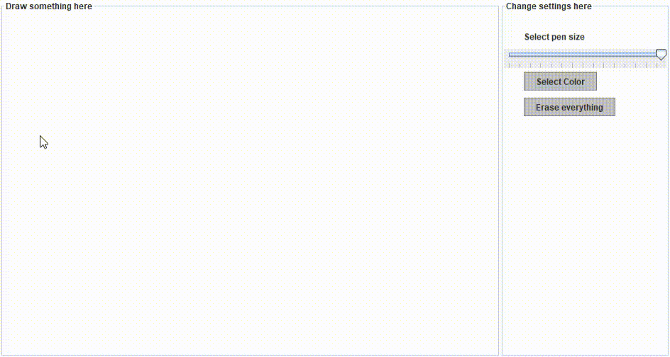
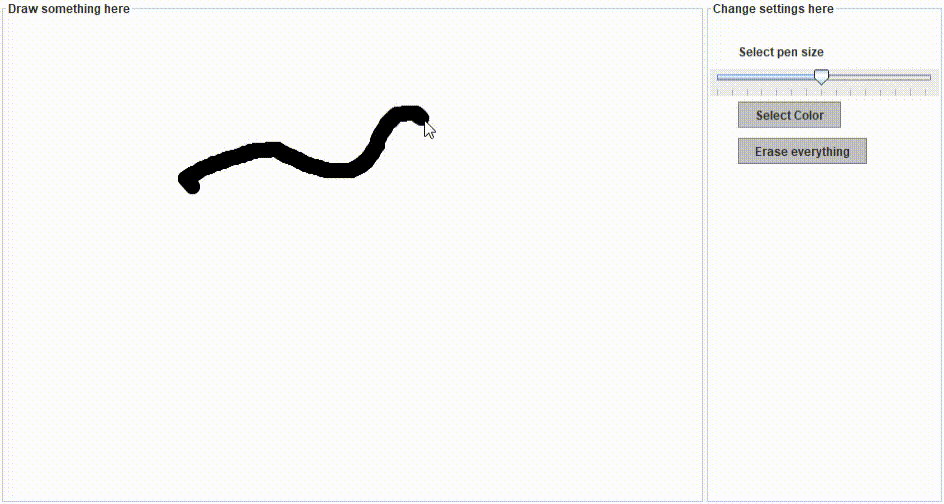
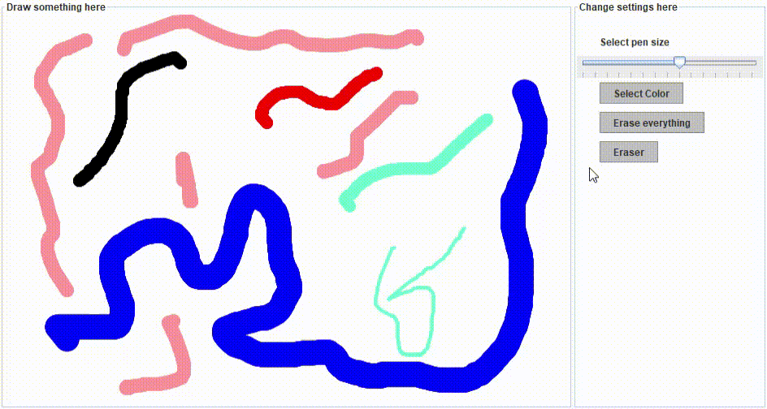

# draw_GUI  
## ABOUT
**A simple drawing GUI** inspired by [paint](https://it.wikipedia.org/wiki/Paint) but trying to make it better.   

### USAGE

* Until now **you are able** to:
    * Draw with the pen
    
    * Change the pen size
    
    * Change color
    * Clear the canvas
    * Erase a line 
    
    * Select a line with the [RMB](https://www.acronymfinder.com/Right-Mouse-Button-(RMB).html), move it around and re-place it always with RMB
    
    * Change a line's color :
        * **HOW TO:**
            * Select a color
            * Press on the line which color you want to change with [MMB](http://acronymsandslang.com/definition/7914493/MMB-meaning.html)
            * Color is now changed
        
    * All the rest is **WIP** 
    
##  TODO
- [ ] Add more tools
- [ ] Improve UX and UI
- [ ] Add multiple panels
- [ ] Introduce the image import options
- [X] Add eraser
- [ ] Add customizable tools
- [ ] ...

## Author
* Main Author
   * [Stefano Scolari](https://www.linkedin.com/in/stefano-scolari-7a9440170/) 

* Contributors 
   * [Tommaso Patriti](https://github.com/Ro0t-set) 
   * [Alessandro Mazzoli](https://github.com/alemazzo)

## License

- **[MIT license](http://opensource.org/licenses/mit-license.php)**

   
